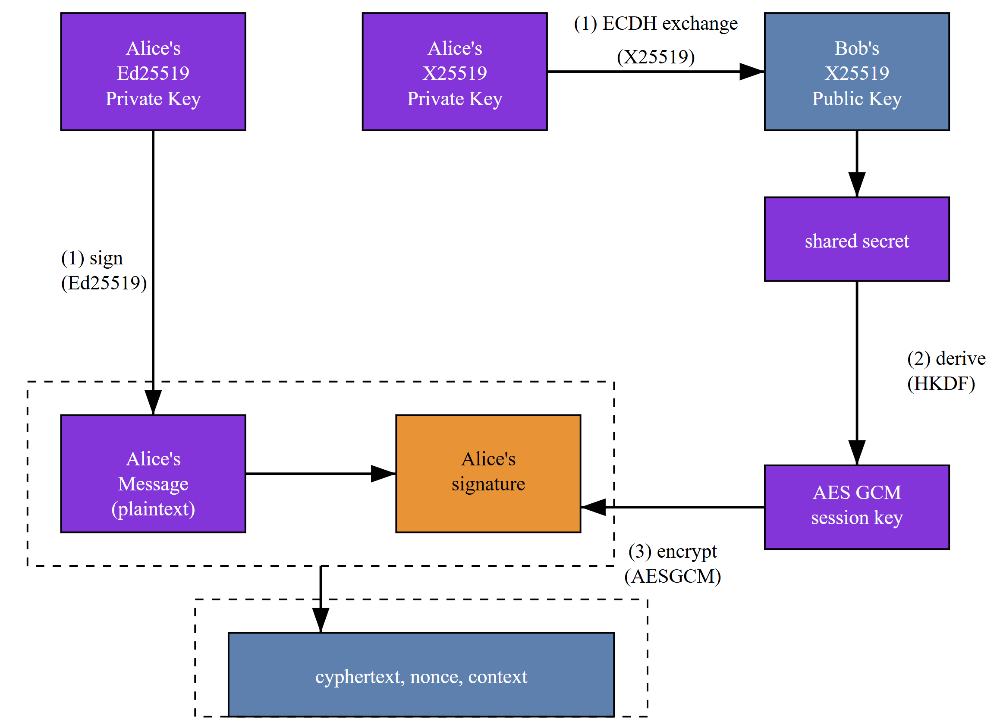
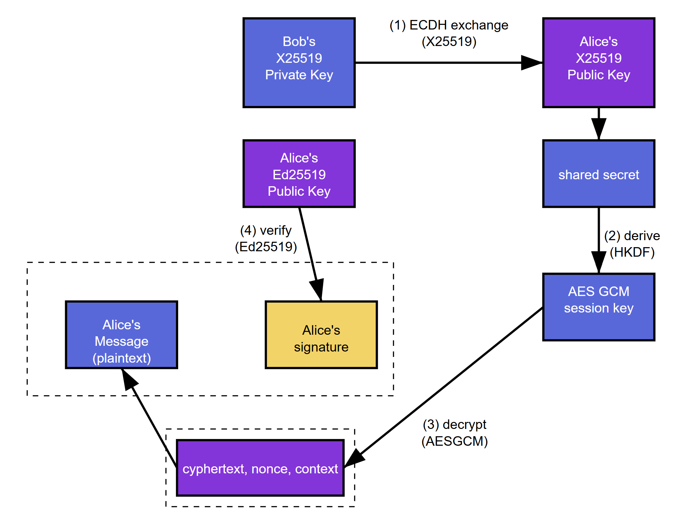

# End-to-End-encryption

## Introduction

This is a variation of the game [Telephone](https://en.wikipedia.org/wiki/Chinese_whispers) using end-to-end encryption.

Originally in the game Telephone, the first person whispers a message to a second person, who whispers it to a third person, and so on, until the message reaches the last person, who then announces it to the entire group. It is surprising to see how a message can become distorted as it is passed from person to person through verbal communication.

In this version of the game, however, you will play a more reliable variant of this game using a hybrid cryptosystem to achieve end-to-end encryption.

## Cryptosystem
Below is a list of the main components of the hybrid cryptosystem used in this assignment.

    - Elliptic Curve Diffie-Hellman key exchange (ECDH) using Curve25519 (X25519)
    - HMAC-based Extract-and-Expand Key Derivation Function (HKDF)
    - Edwards-curve Digital Signature Algorithm (EdDSA) with Ed25519
    - Authenticated Encryption with AES block cipher utilizing Galois Counter Mode (AES-GCM)

The X25519 key exchange enables two parties, Alice and Bob, to agree on a shared secret using an insecure channel. Then, they derive an AES key from the shared secret using HKDF. Ed25519 is used to sign messages and verify authenticity. Finally, the derived AES key is used for symmetric encryption and decryption of messages and signatures using AES-GCM. These cryptographic components form a robust and efficient communication framework that operates securely over an insecure communication channel, achieving end-to-end encryption (E2EE) and preserving message confidentiality, authenticity, and integrity.

Let us say Alice will send a message to Bob using this cryptosystem. The following diagrams demonstrate how the cryptosystem works from the point of view of Alice (sender):

   
 
  
 <em>Alice</em>

and Bob(recipient):

   
 
  
 <em>Bob</em>

## Resources
The heavy lifting for the creation of this game comes from the [cryptography](https://cryptography.io/) library. Below are some important documentation points used for the code.

- [Key serialization](https://cryptography.io/en/latest/hazmat/primitives/asymmetric/serialization/)
- [X25519](https://cryptography.io/en/latest/hazmat/primitives/asymmetric/x25519/)
- [Ed25519](https://cryptography.io/en/latest/hazmat/primitives/asymmetric/ed25519/)
- [HKDF](https://cryptography.io/en/latest/hazmat/primitives/key-derivation-functions/#hkdf)
- [AES-GCM](https://cryptography.io/en/latest/hazmat/primitives/aead/#cryptography.hazmat.primitives.ciphers.aead.AESGCM)

In this variation of Telephone, suppose we create a group with Alice, Bob, and Charlie. We can say that Alice chose Bob to send the starting message to, the Bob chose Charlie. Charlie is the last one and must send a message to Alice to close the cycle and find out if the original message changed or tampered with.

Alice -> Bob -> Chalie -> Alice